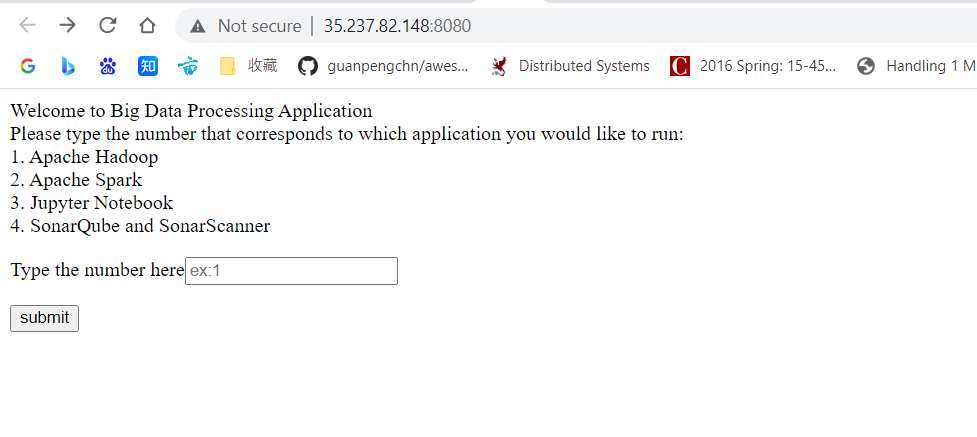
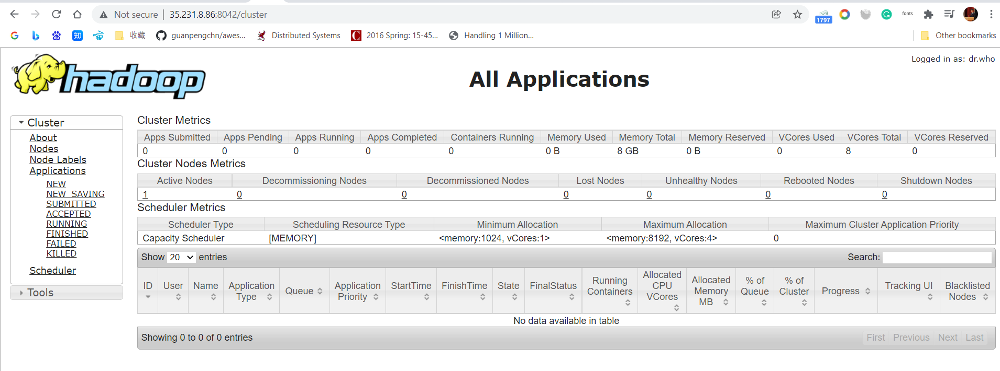
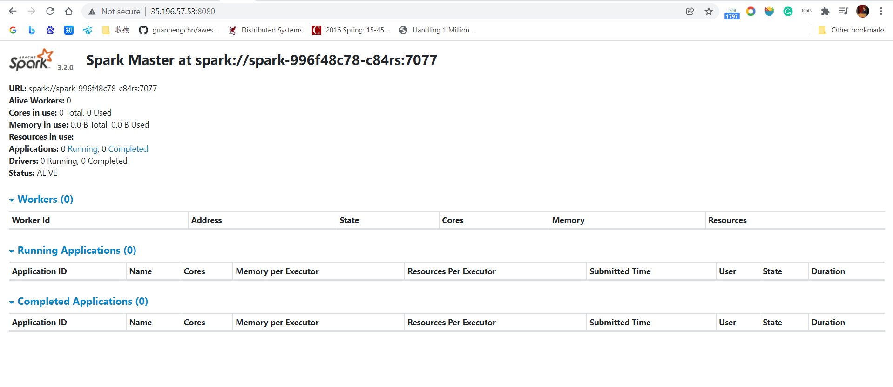
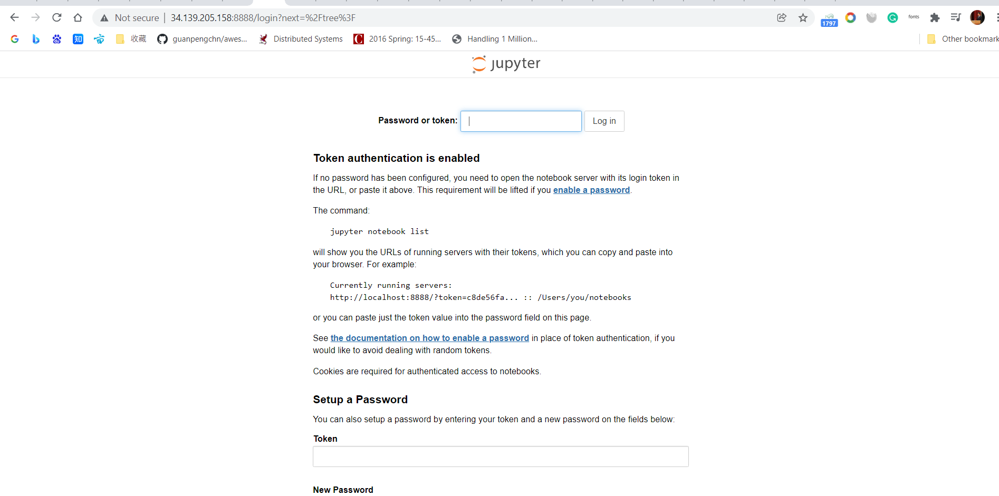
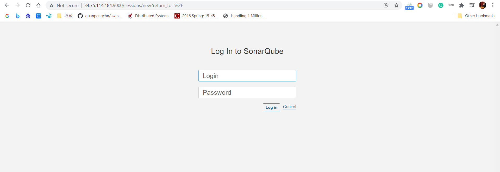
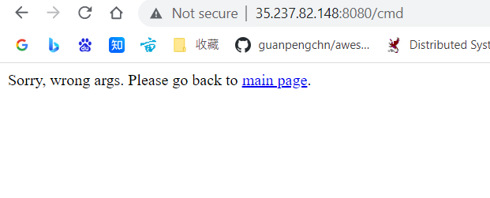

# Steps to start the project

## 1.pull docker images from dockerhub, tag the image, deploy on GCP, and expose the service

- Alert:warning:: The following services are deployed on personal cluster, which is shut down after finishing demo videos. To run this project on local machine, please deploy the following services first and change the ip in the code.

The ip mappings are configured in application.properties. Just change the ips to the ip of deployed services.

To get the image on GCP, the following is the example for deploying spark.
```dockerfile
docker pull bitnami/spark
docker tag bitnami/spark gcr.io/turing-zone-326402/malingzhi58/spark:2
docker push gcr.io/turing-zone-326402/malingzhi58/spark:2
```
### Apache Hadoop
```dockerfile
docker pull harisekhon/hadoop 
```
expose mapping 8042:8088

example ip: http://35.231.8.86:8042/
### Apache Spark
```dockerfile
docker pull bitnami/spark
```
expose mapping 8080:8080

example ip: http://35.196.57.53:8080/

### jupyternotbook
```dockerfile
docker pull jupyter/minimal-notebook
```
expose mapping 8888:8888

http://34.139.205.158:8888/
### SonarQube and SonarScanner
```dockerfile
docker pull sonarqube
```
expose mapping 9000:9000

http://34.75.114.184:9000/

## 2.depoly my web service
I build, push the docker to docker hub and deploy it on GCP. 
```dockerfile
docker pull malingzhi58/848proj2
docker tag malingzhi58/848proj2 gcr.io/turing-zone-326402/malingzhi58/finalproj:2
docker push gcr.io/turing-zone-326402/malingzhi58/finalproj:2
```
The following pics are the screenshots for the project.





